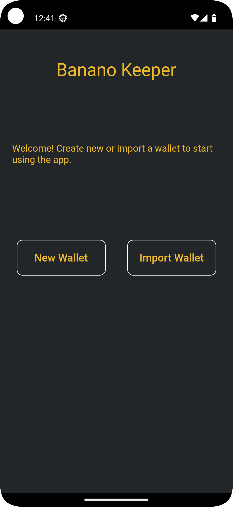
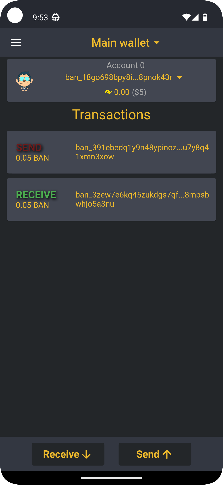
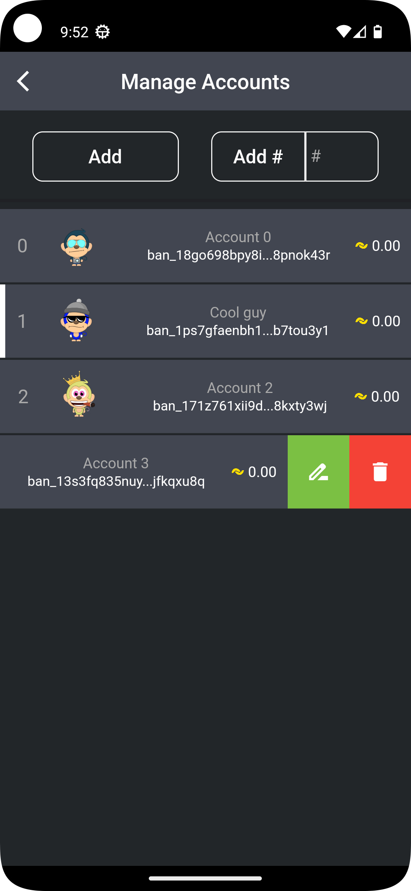
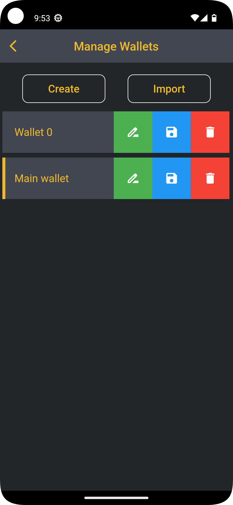
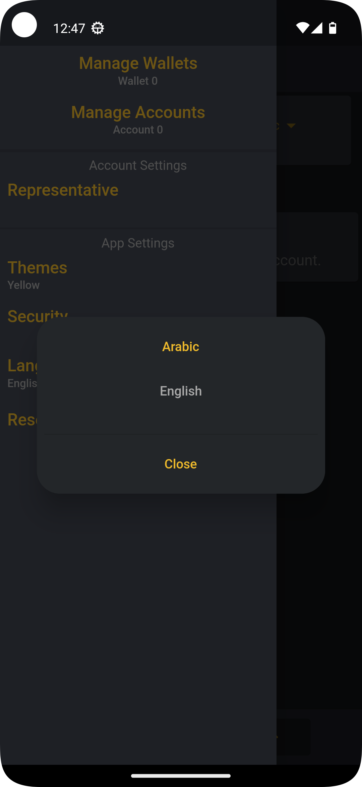
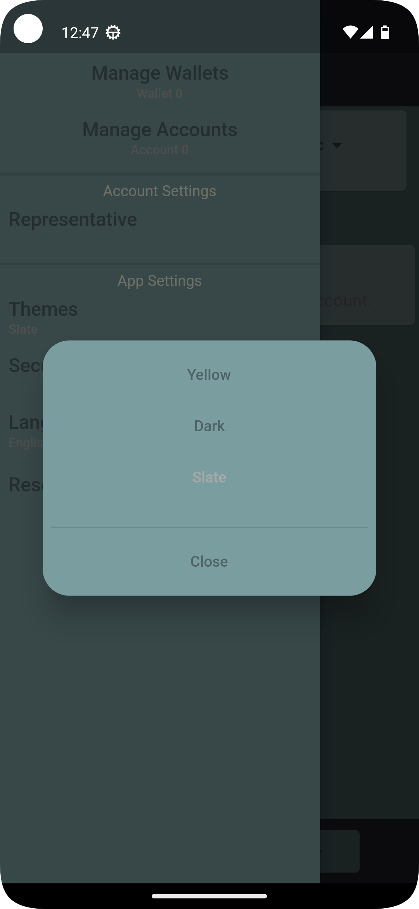

# Banano Keeper

Banano Keeper is a multi-wallet for Banano cryptocurrncy for Android, iOS and windows.

it features:
- Creating a new or importing an existing wallet.
- Local wallet backup
- View transactions of your accounts.
- Send and receive banano.
- Scan QR Code to send.
- Set account-specific representative.
- Authentication using pin and/or biometric.
- Enable/Disable auth on startup.
- Change PIN
- Themes (more to come).
- Localization support (more to come).

currently, only Android version compiled and ready to be tested

## Screenshots
 
 
 
