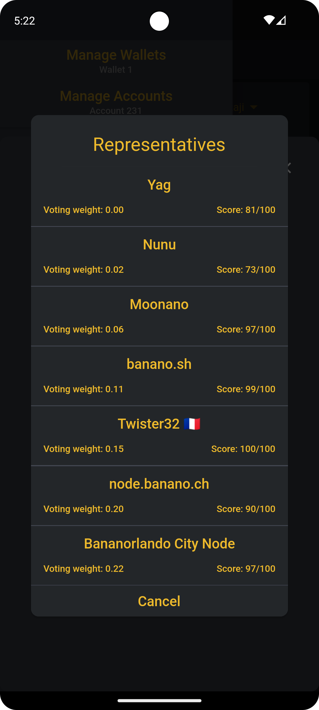
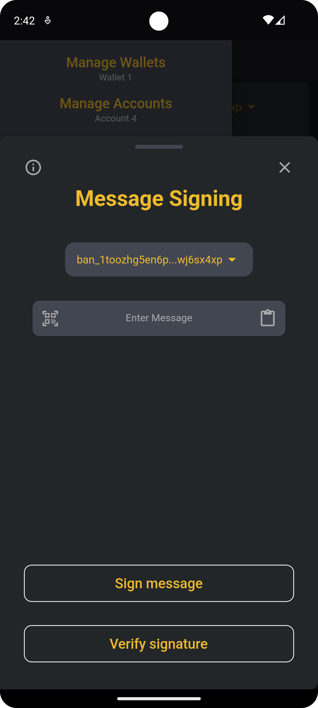
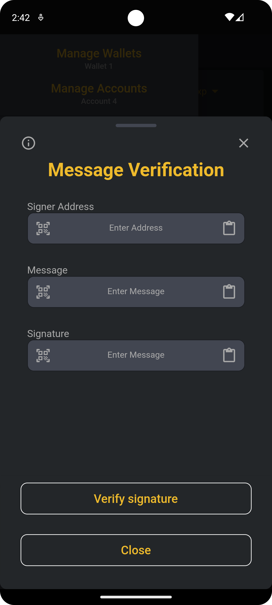

# Banano Keeper

Banano Keeper is a multi-wallet for Banano cryptocurrency for Android, iOS and Windows.

Its features:

- Create a new or import an existing wallet.
- Local wallet backup.
- View transactions of your accounts.
- Send and receive Banano.
- Scan QR Code to send.
- Set account-specific representative.
- Authentication using pin and/or biometric.
- Auth on startup.
- Themes (more to come).
- Localization support (more to come).
- Local work generation
- Message signing

Currently, only Android version is compiled and ready to be tested.

## Screenshots
 
 
 
  
